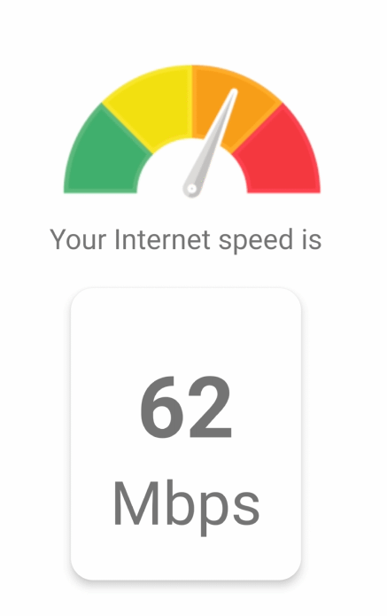

This is a [**React Native**](https://reactnative.dev) project, using [`@react-native-community/cli`](https://github.com/react-native-community/cli).

# 📄 Brief description of the app

Speedometer gives you hard facts on your internet speeds so you can optimize connectivity. Is simple app shows internet speed in Mbps.
Entirely developed with react native 📱. 

# 📱 Screenshot of the app



.png)

.png)

.png)

.png)

.png)

# Getting Started

>**Note**: Make sure you have completed the [React Native - Environment Setup](https://reactnative.dev/docs/environment-setup) instructions till "Creating a new application" step, before proceeding.

## 🔵 Step 1: Install

Once you have configured your environment, after that you should proceed as with any javascript project:

- Go to the root folder of your project and run:

```bash
# using npm
npm install

# OR using Yarn
yarn install
```

to finish configuring the environment and project dependencies.

>**Note**: In case you want to run the application in the emulator, you must first make sure that it is running either from **Android Studio** or **Xcode**, this step is necessary before continuing.

## 🔵 Step 2: Start the Metro Server

First, you will need to start **Metro**, the JavaScript _bundler_ that ships _with_ React Native.

To start Metro, run the following command from the _root_ of your React Native project:

```bash
# using npm
npm run start

# OR using Yarn
yarn start
```

## 🔵 Step 3: Start your Application

>**Note**: This step is optional, if before in step 2 we selected the platform where to run the application either **Android** or **iOS**, we would actually be running this same step (Step 3).

Let Metro Bundler run in its _own_ terminal. Open a _new_ terminal from the _root_ of your React Native project. Run the following command to start your _Android_ or _iOS_ app:

### For Android

```bash
# using npm
npm run android

# OR using Yarn
yarn android
```

### For iOS

```bash
# using npm
npm run ios

# OR using Yarn
yarn ios
```

If everything is set up _correctly_, you should see your new app running in your _Android Emulator_ or _iOS Simulator_ shortly provided you have set up your emulator/simulator correctly.

This is one way to run your app — you can also run it directly from within Android Studio and Xcode respectively.

## 🚀 Congratulations! :tada:

You've successfully run your Speedometer App. :partying_face:
