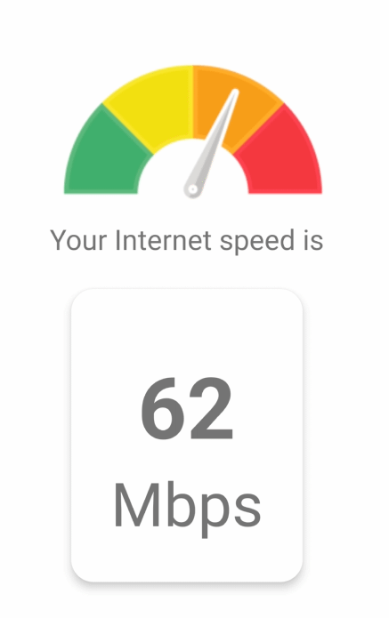

Este es un proyecto [**React Native**](https://reactnative.dev), usando [`@react-native-community/cli`](https://github.com/react-native-community/cli).

# 📄 Breve descripción de la aplicación

Speedometer te da datos concretos sobre tu velocidad de Internet para que puedas optimizar la conectividad. Es simple aplicación muestra la velocidad de Internet en Mbps. Enteramente desarrollado gracias a React Native 📱.

# 📱 Capturas de pantalla de la aplicación



.png)

.png)

.png)

.png)

.png)


# Primeros pasos

>**Nota**: Asegúrese de haber completado las instrucciones de [React Native - Environment Setup](https://reactnative.dev/docs/environment-setup) hasta el paso "Crear una nueva aplicación", antes de continuar.

## 🔵 Paso 1: Instalar

Una vez configurado tu entorno, después de eso debes proceder como con cualquier proyecto javascript:

- Ve a la carpeta raíz de tu proyecto y ejecuta:

```bash
# using npm
npm install

# OR using Yarn
yarn install
```
para terminar de configurar el entorno y las dependencias del proyecto.

>**Nota**: En caso de que desees ejecutar la aplicación en el emulador, debes primero asegurarte de que se este ejecutando ya sea desde **Android Studio** o **Xcode**, este paso es necesario antes de continuar.


## 🔵 Paso 2: Iniciar el Metro Server

En primer lugar, tendrás que iniciar **Metro**, el _bundler_ de JavaScript que viene _con_ React Native.

Para iniciar Metro, ejecuta el siguiente comando desde el _root_ de tu proyecto React Native:

```bash
# using npm
npm run start

# OR using Yarn
yarn start
```

## 🔵 Paso 3: Inicie su aplicaci&#243;n

>**Nota**: Este paso es opcional, si antes en el paso 2 seleccionamos la plataforma en donde ejecutar la aplicacón ya sea **Android** o **iOS**, en realidad estaría ejecutando este mismo paso (Paso 3).

Deja que Metro Bundler se ejecute en su _propia_ terminal. Abre un _nuevo_ terminal desde el _root_ de tu proyecto React Native. Ejecuta el siguiente comando para iniciar tu aplicación _Android_ o _iOS_:


### Para Android

```bash
# using npm
npm run android

# OR using Yarn
yarn android
```

### Para iOS

```bash
# using npm
npm run ios

# OR using Yarn
yarn ios
```

Si todo está configurado _correctamente_, usted debe ver su nueva aplicación que se ejecuta en su _Android Emulator_ o _iOS Simulator_ 
Brevemente, siempre que hayas configurado correctamente tu emulador/simulador.

Esta es una forma de ejecutar tu aplicación - también puedes ejecutarla directamente desde Android Studio y Xcode respectivamente.

## 🚀 Enhorabuena! :tada:

Has ejecutado con éxito Password generator App. :partying_face:
